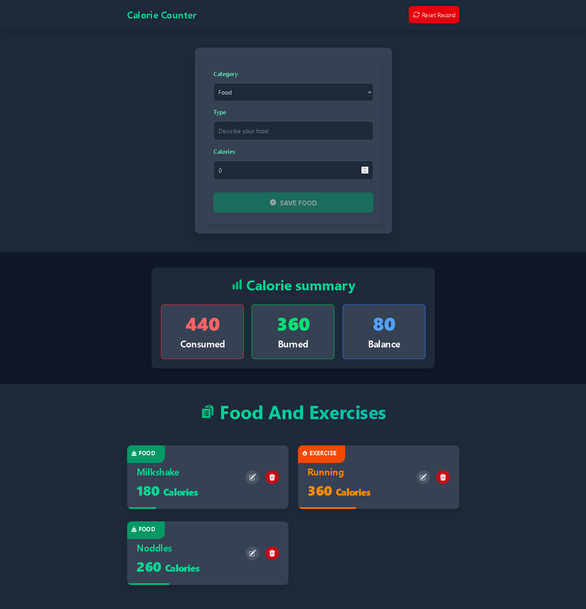
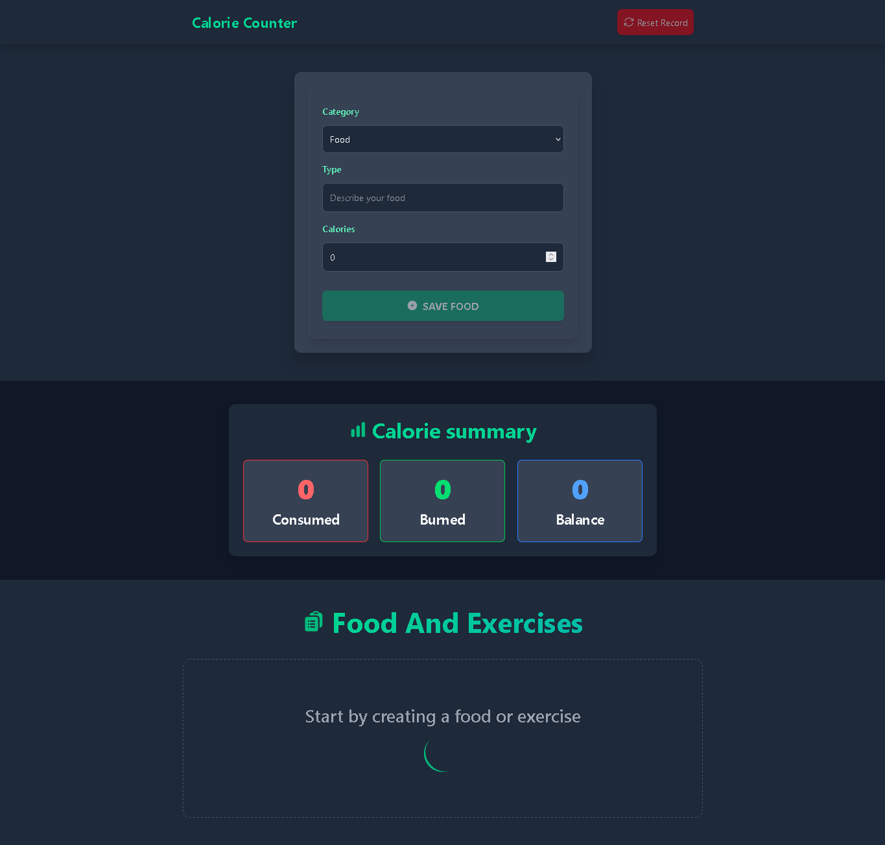

# Calorie Counter

A simple yet effective Calorie Counter application built with React and TypeScript. This app helps users track their calorie intake and expenditure, displaying a summary of consumed, burned, and balance calories.


## 🚀 Live Preview
Check out the live demo: [Calorie Counter](https://calorie-balance-calculator.netlify.app/)

## 📸 Screenshots
### Home View with Entries


### Home View (No Entries)


## 📦 Features
- **Add, Edit, and Delete Activities**: Users can log their food consumption and exercises.
- **Calorie Summary**: Displays total calories consumed, burned, and the balance.
- **Dark Mode UI**: Modern and stylish dark theme.
- **LocalStorage Support**: Saves user data persistently in the browser.
- **Reset App Functionality**: Allows users to clear all entries and start fresh.
- **Animations and Transitions**: Smooth UI interactions.

## 🛠️ Technologies Used
- **React** (with TypeScript) for building the UI.
- **Tailwind CSS** for styling.
- **Heroicons** for icons.
- **uuid** for generating unique IDs.
- **LocalStorage API** for data persistence.

## 📂 Project Structure
```
calorie-counter/
│── public/
│   ├── fire.svg (favicon)
│── src/
│   ├── components/
│   │   ├── ActivityList.tsx
│   │   ├── CalorieCategory.tsx
│   │   ├── CalorieTracker.tsx
│   │   ├── Form.tsx
│   ├── data/
│   │   ├── categories.ts
│   ├── reducers/
│   │   ├── activityReducer.ts
│   ├── types/
│   │   ├── index.ts
│   ├── App.tsx
│   ├── main.tsx
│   ├── index.tsx
│── .gitignore
│── package.json
│── tsconfig.json
│── vite.config.ts
│── README.md
```

## 💻 Setup Instructions
1. Clone the repository:
   ```sh
   git clone https://github.com/Diego3128/calorie-counter
   ```
2. Navigate to the project directory:
   ```sh
   cd calorie-counter
   ```
3. Install dependencies:
   ```sh
   npm install
   ```
4. Start the development server:
   ```sh
   npm run dev
   ```

## 🏗️ Future Enhancements
- Add user authentication.
- Sync data with a database.
- Implement charts for better data visualization.

## 📜 License
This project is open-source and available under the MIT License.

